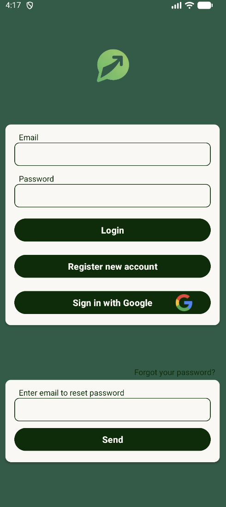
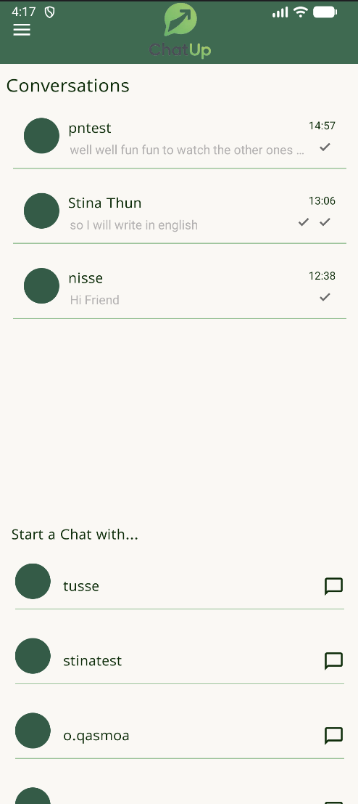
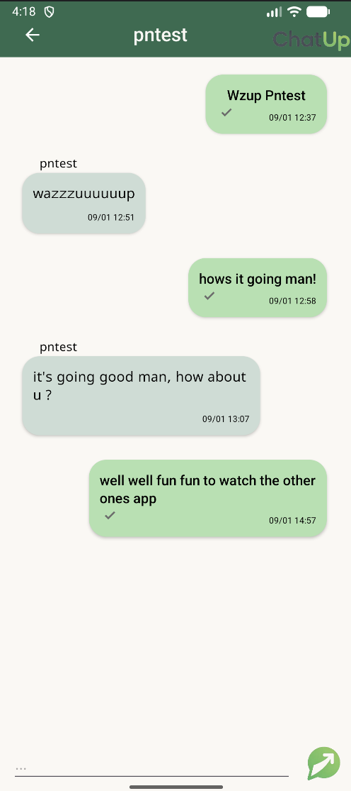
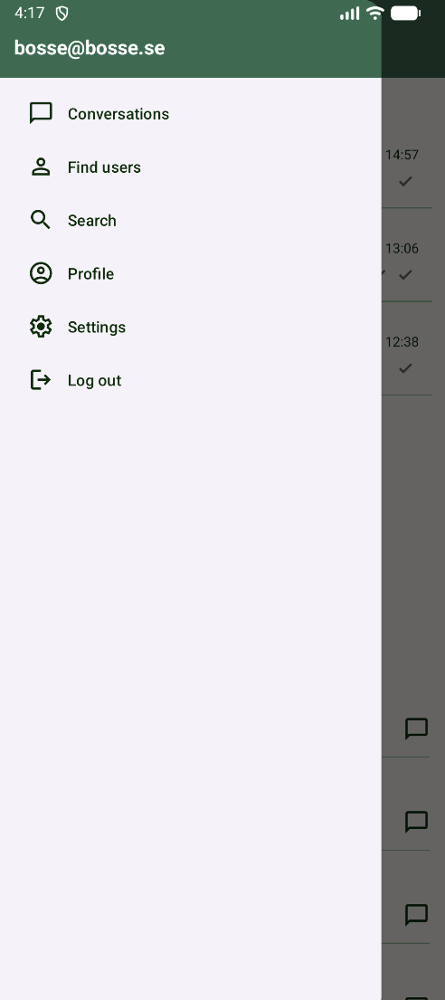

# 💬 ChatUp

[](https://kotlinlang.org)
[](https://www.android.com)
[](https://firebase.google.com)
[](https://developer.android.com/jetpack/guide)

A production-ready, real-time messaging application for Android built with modern architecture patterns and Firebase backend. ChatUp demonstrates clean code principles, reactive programming with LiveData, and seamless real-time synchronization using Cloud Firestore.

## 📱 Screenshots

| Login | Conversations | Chat | Navigation |
|-------|---|---|---|
|  |  |  |  |

## 🎯 Core Features

### Authentication & User Management
- **Multi-method Authentication:** Email/password and Google Sign-In integration
- **User Discovery:** Search and browse user profiles  
- **User Presence:** Real-time status indicators (online/offline)

### Real-Time Messaging
- **Private Conversations:** Direct messaging with delivery status tracking
- **Group Chats:** Create and manage group conversations
- **Typing Indicators:** See when users are composing messages
- **Message Status:** Read receipts and delivery confirmation

### User Experience
- **Navigation Drawer:** Quick access to profile and settings
- **Responsive Design:** Built with Material Design 3 components
- **Live Updates:** Real-time synchronization across all clients

## 🏗️ Architecture

### MVVM Pattern with Repository Layer
```
UI (Activities/Fragments)
    ↓
ViewModel (LiveData)
    ↓
Repository/Manager
    ↓
Firebase Backend
```

### Key Components

**ViewModels:**
- `AuthViewModel` — Handles authentication logic and user registration
- `ChatViewModel` — Manages private conversation state and message updates
- `GroupChatViewModel` — Orchestrates group chat functionality
- `ConversationListViewModel` — Maintains conversation list state
- `UsersViewModel` — Manages user discovery and search
- `ProfileViewModel` — Handles user profile management

**Data Layer:**
- `FirebaseManager` — Centralized Firebase operations
- `AuthRepository` — Authentication-specific logic
- Real-time Firestore listeners for instant updates

**Adapters:**
- `ChatRecViewAdapter` — Message list rendering
- `ConversationsRecViewAdapter` — Conversation list display
- `UserAdapter` — User search results

## 💻 Technology Stack

| Technology | Purpose |
|---|---|
| **Kotlin** | Modern, type-safe language |
| **MVVM Architecture** | Clean separation of concerns |
| **Firebase Authentication** | Secure user auth (email/password + Google) |
| **Cloud Firestore** | Real-time NoSQL database |
| **LiveData** | Reactive data binding |
| **Jetpack Lifecycle** | Lifecycle-aware components |
| **ViewBinding** | Type-safe view access |
| **RecyclerView** | Efficient list rendering |
| **Material Design 3** | Modern UI components |
| **Glide** | Image loading and caching |

## 📂 Project Structure

```
chatup/
├── app/src/main/java/com/example/chatup/
│   ├── activities/         # Activity screens
│   ├── fragments/          # Fragment components
│   ├── viewmodel/          # MVVM ViewModels
│   ├── repository/         # Data layer (AuthRepository)
│   ├── mananger/           # Business logic (FirebaseManager)
│   ├── adapters/           # RecyclerView adapters
│   ├── data/               # Data models (User, ChatMessage, etc.)
│   └── utils/              # Utility classes (NotificationHelper)
├── build.gradle.kts        # Gradle dependencies
└── AndroidManifest.xml     # App configuration
```

## 🚀 Getting Started

### Prerequisites
- Android Studio (latest)
- Android API 26+
- Firebase project setup

### Installation

1. **Clone the repository**
   ```bash
   git clone https://github.com/PatNoO/chatup.git
   cd chatup
   ```

2. **Configure Firebase**
   - Add your `google-services.json` to the `app/` directory
   - Enable Firebase Authentication and Cloud Firestore in Firebase Console

3. **Build & Run**
   ```bash
   ./gradlew build
   # Run on emulator or connected device via Android Studio
   ```

## 📖 Usage

1. **Register or Login** — Create account or authenticate via Google
2. **Browse Users** — Search and view user profiles
3. **Start Conversation** — Initiate private or group chats
4. **Send Messages** — Real-time message delivery with status indicators
5. **Manage Profile** — Update profile information via navigation drawer

## 🔒 Security Considerations

- Firebase security rules restrict data access to authenticated users
- User data is properly scoped and isolated
- Sensitive credentials stored in Firebase project configuration

## 🎓 Learning Highlights

This project demonstrates:
- Clean MVVM architecture with proper separation of concerns
- Real-time data synchronization with Firestore listeners
- Reactive programming patterns using LiveData
- Firebase integration best practices
- Material Design implementation
- Efficient RecyclerView management

## 🛣️ Future Enhancements

- Message search and filtering
- User blocking/muting functionality
- Rich media messaging (images, files)
- End-to-end encryption
- Offline message queue
- Push notifications via Firebase Cloud Messaging

## 📄 License

This project is open source and available under the MIT License.

---
